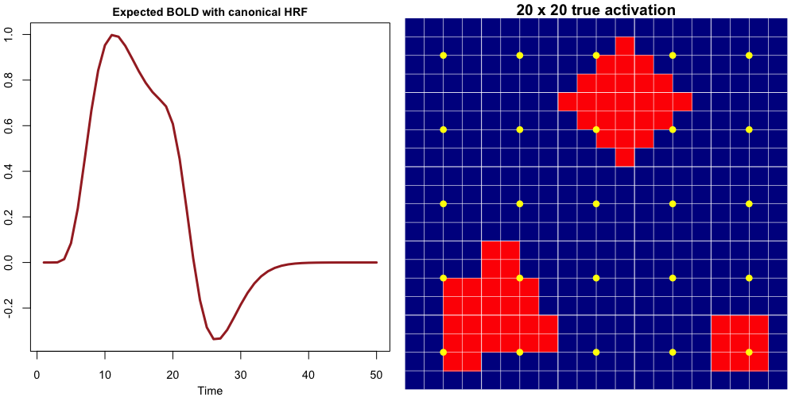
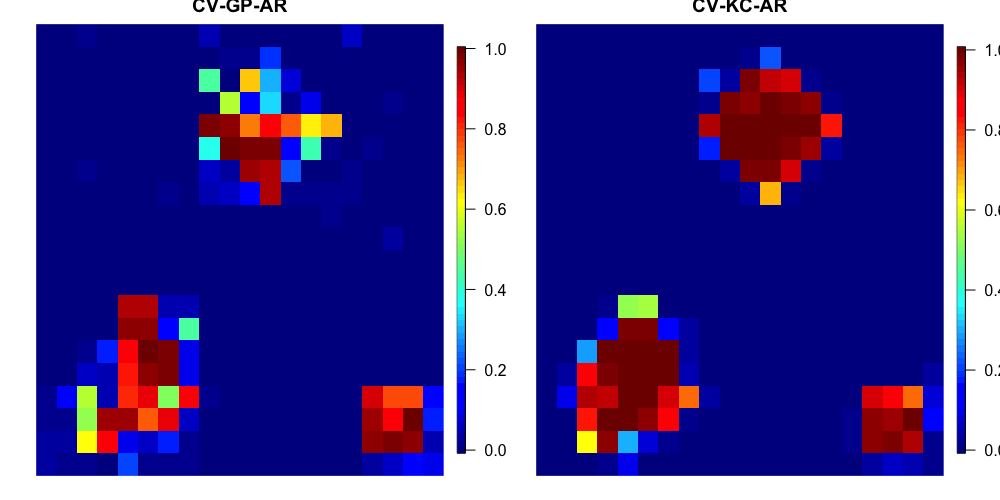

# cv-kc-ar

This repository contains relevant R code for implementing the MCMC algorithm (CV-KC-AR) of the Bayesian Spatiotemporal Model for complex-valued task-based fMRI data (CV-fMRI). The proposed spatiotemporal model combines Bayesian variable selection tools, a spatial kernel convolution structure, and autoregressive processes for detecting a subject's brain activation at the voxel level in complex-valued fMRI (CV-fMRI) data. The model leads to more accurate posterior probability activation maps and less false positives than alternative spatial approaches based on Gaussian process models, and other complex-valued models that do not incorporate spatial and/or temporal structure. For more details about CV-KC-AR model and algorithm, please read the paper [Yu et al. (2021). Bayesian Spatiotemporal Modeling on Complex-valued fMRI Signals via Kernel Convolutions](https://arxiv.org/abs/2009.07745)

## Demo and Usage

### Required packages and R version
The required R packages include `"mvtnorm", "Matrix", "pscl", "matrixcalc", "neuRosim", "pryr", "pROC"`, `"tikzDevice", "abind", "fields", "Hmisc", "Rcpp", "RcppArmadillo", "emulator", "abind"`. The can be loaded using the script `load_packages.R`. The package **parallel** and **doParallel** are used for simple multi-core computing. The latest R version is recommended, but any version >= 3.6 should work. When C++ code is compiled, [C++11 should be used with Rcpp](https://gallery.rcpp.org/articles/first-steps-with-C++11/).

### Functions
The functions created by the authors are saved in `./my_fcns.R`, `./mcmc_fcns.R` and `./mcmc_cpp_fcns.R`. The functions written in C++ are saved in the `./rcpp` folder.

### Simulated data and fMRI data
Relevant data sets for analysis in the paper are stored in `./data` folder. The simulated data are generated using the script `AR1SimData_generate.R` that depends on other scripts such as `AR1SimData.R`, `SimExpDesign.R`, `regionlabel.R`, and `SimDesignMatRegCoefAR.R`. The human fMRI data set is stored in the R object `fmridata.RData`.

### Starts with a demo
The R script `demo.R` provide an example to illustrate how the algorithm is implemented with a simulated data set. The data set is the first simulated data set `Spa_AR1_sim1_rho5.RData` stored in `./data`. The function `mcmc_kcs_ar_block_cpp_full()` implements CV-KC-AR and the `mcmc_gp_ar_cpp_full()` function implements CV-GP-AR. The functions returns a list including the MCMC samples and other information such as warm-up, thinning and the number of iterations.

### Multiple-slice simulation and data analysis
The entire multiple-slice simulation study and data analysis in the paper can be reproduced by running the scripts `./sim_multi_slice.R` and `./data_analysis.R`.

## Basic Results from `demo.R`

The expected BOLD signals generated by the canonical HRF, and the simulated activation map are shown below.

Voxels colored in red are activated, and the yellow dots are the spatial sites for kernel convolution.

The posterior probability maps are shown below. Note that CV-KC-AR performs better than CV-GP-AR because in general it produces higher posterior probability of activation in activation regions, leading to higher true positive rate.

